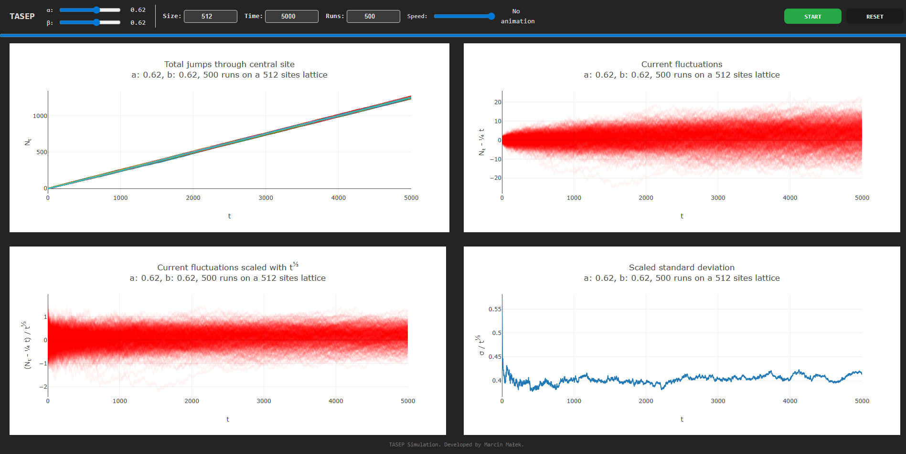
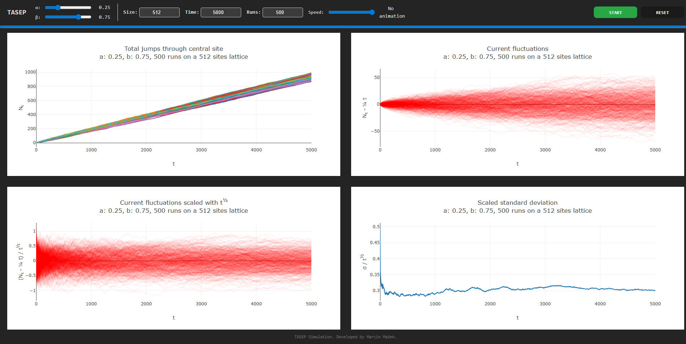

# TASEP Simulation: Current Fluctuations

This project implements a stochastic particle system to verify scaling laws of current fluctuations. It serves as a computational playground to observe how simple local rules can lead to complex macroscopic phases and universal mathematical patterns known as the **KPZ universality class**.

This project is highly influenced by:

[Prähofer, Michael & Spohn, Herbert. (2018). Current Fluctuations for the Totally Asymmetric Simple Exclusion Process.](https://arxiv.org/pdf/cond-mat/0101200v2)


## What is TASEP?

**Totally Asymmetric Simple Exclusion Process** is a fundamental model in non-equilibrium statistical physics. It consists of 1D lattice where particles hop *(in contrast to ASEP)* only to the right. It is widely used to model:
*   Ribosomes moving along mRNA
*   Traffic flow
*   Directed polymers

The dynamics are governed by three simple parameters:
1.  **Injection ($\alpha$):** Particles enter from the left.
2.  **Hopping:** Particles jump to the next site (if empty) with rate 1.
3.  **Extraction ($\beta$):** Particles exit to the right.

## What is the point?

We are interested in the **Integrated Current ($N_t$)** — the total number of particles crossing the center of the system over time $t$.

While the average flow is linear ($J \cdot t$), the current **fluctuations** reveal interesting mathematical properties. We test the hypothesis that fluctuations scale as:

$$ \Delta N_t \sim t^\gamma $$

Depending on the density, the system falls into different **Universality Classes**:

| Phase | Conditions | Current ($J$) | Scaling Exponent ($\gamma$) |
| :--- | :--- | :--- | :--- |
| **Max Current (MC)** | $\alpha, \beta > 0.5$ | $J = 1/4$ | **$1/3$ (KPZ Class)** |
| **Low/High Density** | $\alpha < 0.5$ or $\beta < 0.5$ | $\alpha(1-\alpha)$ or $\beta(1-\beta)$ | **$1/2$ (Gaussian)** |

The goal of this simulation is to verify the **$t^{1/3}$ anomalous scaling** in the Max Current phase, confirming the findings of [Prähofer & Spohn publication](https://arxiv.org/pdf/cond-mat/0101200v2).

---





---

## Repository Structure

This project is split into two branches targeting different use cases:

### 1. `master` branch: The basic implementation
*Node.js* solution which is a good choice for heavy computations and data collection without the overhead of a UI. Generates static plots in web browser using *[nodeplotlib](https://github.com/ngfelixl/nodeplotlib)*.

#### Usage:
```bash
# Syntax: node script.js <Size> <Alpha> <Beta> <MaxTime> <Runs>
node script.js 1000 0.8 0.8 5000 100
```
### 2. `ui-version` branch: Interactive implementation
A modern web application implemented in *React* for real-time exploration of the model.

#### Usage:
```bash
git checkout ui-version
npm install
npm run dev
```